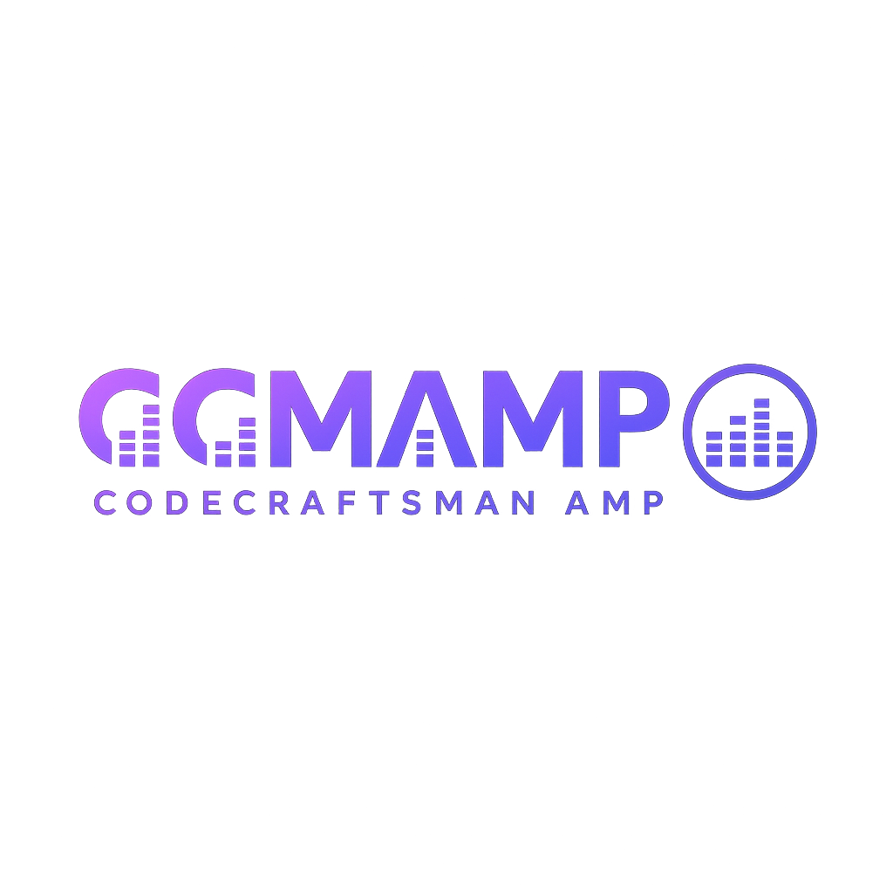

🎵 CCMAMP – CodeCraftsMan Amp



**CCMAMP** (CodeCraftsMan Amp) är en modern och lättanvänd musikspelare byggd med **Python + Qt (PySide6)**.  
Den kombinerar klassisk **Winamp-känsla** med ett modernt mörkt tema, stöd för spellistor och en snygg **equalizer som rör sig efter musiken**.

---

## ✨ Funktioner

- 🎶 Spela upp vanliga ljudformat: **MP3, WAV, FLAC, OGG, AAC, M4A**
- 📂 Dra & släpp låtar eller lägg till hela mappar
- 📝 Hantera **spellistor** (`.m3u` import/export med #EXTINF metadata)
- 🔁 Stöd för **Shuffle** och **Repeat**
- 🔊 Volymkontroll med smidigt reglage
- 📈 **Live Equalizer** (FFT-analys via `pydub` + `ffmpeg`)
- 🎨 Modernt mörkt UI med snygg design
- 💾 Automatisk visning av speltid
- 🖼 **Egen logga & ikon** för appen
- ⌨️ Kortkommandon:
  - `Space` → Play/Pause
  - `Ctrl+Right` → Nästa spår
  - `Ctrl+Left` → Föregående spår

---

## 🖼 Skärmbild

*(Lägg gärna in en screenshot här)*

---

## 🚀 Installation

### Förutsättningar
- **Python 3.9+**
- **ffmpeg** (krävs av `pydub` för ljudanalys)

Installera systempaket (Ubuntu/Debian):
```bash
sudo apt update
sudo apt install -y python3-venv ffmpeg
